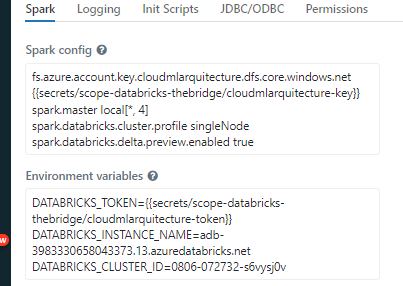

# Documentación Proyecto

Comando para actualizar el python whell `python setup.py bdist_wheel`

### Spark Config

`fs.azure.account.key.cloudmlarquitecture.dfs.core.windows.net {{secrets/scope-databricks-thebridge/cloudmlarquitecture-key}}`

## Enviroment variables 

`
DATABRICKS_TOKEN={{secrets/scope-databricks-thebridge/cloudmlarquitecture-token}}
DATABRICKS_INSTANCE_NAME=adb-3983330658043373.13.azuredatabricks.net
DATABRICKS_CLUSTER_ID=0806-072732-s6vysj0v
`